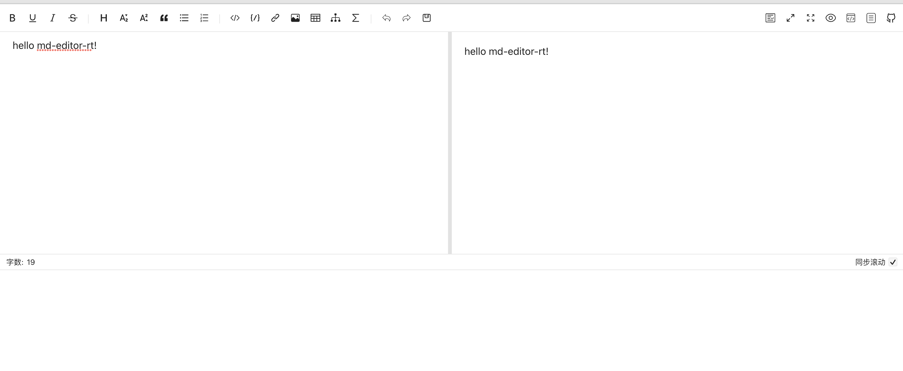

# md-editor-rt

> 一个很好用的 react markdown 编辑器 和展示器,有需求自己写博客网站的小伙伴可以尝试

[传送们](https://imzbf.github.io/md-editor-rt/docs)

> 安装 yarn add md-editor-rt  or npm i md-editor-rt -S

## 初始化

````javascript
import React, { useEffect,useState } from 'react';
import MdEditor from 'md-editor-rt';
import 'md-editor-rt/lib/style.css';

function Md() {
    const [text, setText] = useState('hello md-editor-rt!');
    return <MdEditor modelValue={text} onChange={setText} />;
}

export default Md;
````
<!--  -->
<!--  -->


## props 说明

### modelValue
 > 编辑的内容 可以开始给初始化值

 ### theme
 > 编辑器主题
 ````javascript
 <MdEditor theme="dark" />
 <MdEditor theme="light" />
 ````

 ### previewOnly
 > 仅预览模式，不显示 bar 和编辑框，只支持初始化设置。可开启此模式来渲染md文件


 更多 配置请查看官网
 https://imzbf.github.io/md-editor-rt/

